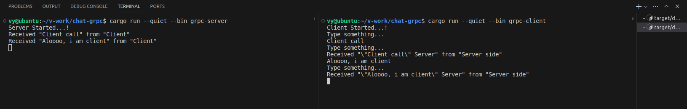

# Chat app with rRPC
> [Youtube tutorial](https://www.youtube.com/watch?v=-5XkMwRBsAo)

## A .Error

### protoc
Install the Protocol Buffers compiler (protoc):
```
sudo apt-get update
sudo apt-get install protobuf-compiler
```

## B. Implementation

### 1. Proto

#### 1.1. Define service
> Path: `proto/chat.proto`
* The package name is `chat` (in line 2)
* Define a struct for chat message: `ChatMessage`
* Define `ChatService` service with function `ChatMessageStreaming`
    ```proto
    rpc ChatMessageStreaming(stream ChatMessage) returns (stream ChatMessage);
    ```
    The `stream` keyword is used to define the bidirectional streaming RPC - both server and client can send a stream of messages to each other

#### 1.2. Compile protobuf

##### Dependencies
> Path: `Cargo.toml`
* Add these lines:
    ```
    [build-dependencies]
    tonic-build = "0.11.0"
    ```
* Build-dependencies: libarares, tools, resources required to build and compile software; are not necessarily required for running the built software
* `tonic-build`: Rust crate (library) --> code generation tool for Protocol Buffers and gRPC  services. Compile `.proto` files into Rust code

##### Build protobuf with Rust
> Path: `build.rs`
* Use `tonic_build::compile_protos("proto/chat.proto")?;`to compile `.proto` into Rust code:
    * message $\rightarrow$ struct
    * service $\rightarrow$ trait (struct with functions definition)
    * client + server stubs: `<service_name>Client`/ `<service_name>Server` with methods to communicate between server and client through gRPC
* The output is stored in `OUT_DIR` - managed by Cargo $\rightarrow$ can not see
* Using the output: `tonic::include_proto!("<package_name>")`

### 2. Server

#### 2.1. Dependencies
> path: `Cargo.toml`
* `tonic`: gRPC library for Rust 
    * generate Rust code from `.proto`
    * asyncronous (on top of `tokio`) for I/O operations
    * streaming
* `prost`: Protocol Buffers implementation for Rust, use while compiling `.proto` to Rust:
    * Serialize/deserialize Protocol Buffers messages
    * Generate Rust structs and enums from `.proto` file
* `tokio`: asynchronous runtime for Rust
    * excute asynschronous tasks
    * mutex, channel..
    * I/O (file, network, timer...)
* `tokio-stream`: asynchronous streams in Tokio
    * Stream Adapter (many types of async streams)
    * Stream Extension
* `async-stream`: macros for creating asynchronous streams

> path: `src/server.rs`
* `std::net`: networking primitives for TCP, UDP, socket address resolution; create and manage network connections
* `std::pin`: `Pin` type, prevent data from being moved in memory (for self-referential structs, asynchronous patterns)

#### 2.2. Implementation
> path: `src/server.rs`
* Define Rust proto as `pb` $\rightarrow$ can use structs, traits... from `.proto` result
    ```
    pub mod pb {
    tonic::include_proto!("chat");
    }
    ```
* Create `ChatServer` struct
* `type ResponseStream = Pin<Box<dyn Stream<Item = Result<ChatMessage, Status>> + Send>>;`
    * `Stream<Item = Result<ChatMessage, Status>> `: stream with item's type is `ChatMessage` or `Status` (error)
    * `dyn`: the actual type of `Stream` at compile time is unknow
    * `Box<...>`: allocate the stream on the heap
    * `Pin<...>`: the stream can not be moved in memory
    * `Stream<> + Send`: stream can be sent across thread boundaries (for asynchrounous)
* `type ChatResult<T> = Result<Response<T>, Status>;`
* Implementation of the `chat_message_streaming` method within the `ChatServer` trait:
    * define the response stream
    * handle incoming stream
    * set up a channel 
    * spawn an async task --> handle imcoming messages and send responses
    * create response stream
    * return response
* Create, build server

#### 2.2. Compile
> path: `Cargo.toml`
* Add:
    ```
    [[bin]]
    name = "grpc-server"
    path = "src/server.rs"
    ```
* Run:  `cargo run --quiet --bin grpc-server`

### 3. Client

#### 3.1. Dependencies

#### 3.2. Implementation
> path: `src/client.rs`
* Define Rust proto as `pb` $\rightarrow$ can use structs, traits... from `.proto` result
    ```
    pub mod pb {
    tonic::include_proto!("chat");
    }
    ```
* Get input: `pub async fn input() -> String {...}`
* Chat: `async fn chat(client: & mut ChatServiceClient<Channel>) {...}`
    * creata a channel
    * handle incoming stream
    * spawn an async task: get user input, ignore ascii case, send to Server
    * get and print Server responses
* Create Client, connect Server and... chat

#### 3.2. Compile
> path: `Cargo.toml`
* Add:
    ```
    [[bin]]
    name = "grpc-client"
    path = "src/client.rs"
    ```
* Run:  `cargo run --quiet --bin grpc-client`

## C. Example
* Run server
* Run client
* Chat from client

